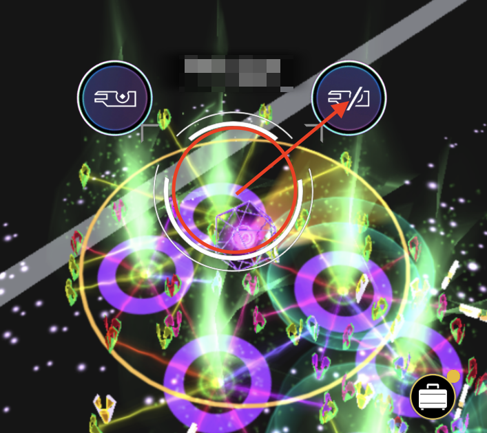
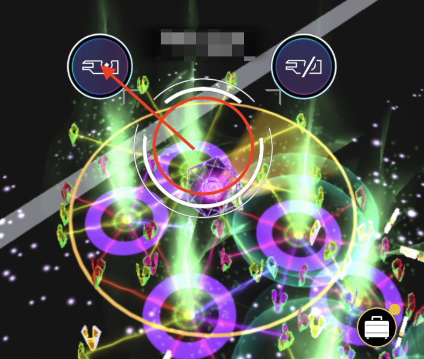
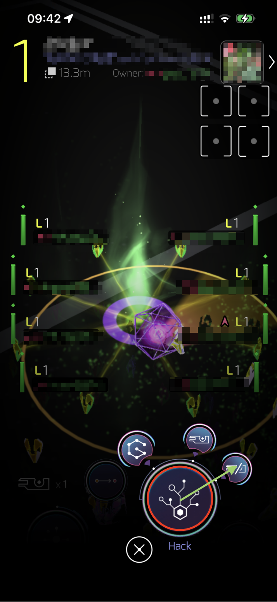
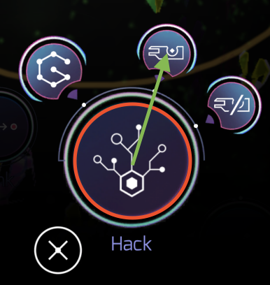
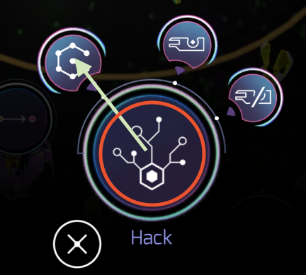

Hack是游戏中最基础的操作，它允许你通过触碰并与[Portal](/INGRESS-GUIDE/reference/portal/)交互来为你生成游戏中的道具。

你可以利用下述的五种方式对[Portal](/INGRESS-GUIDE/reference/portal/)进行Hack。

import { Card, CardGrid } from '@astrojs/starlight/components';
import { Aside } from '@astrojs/starlight/components';

<CardGrid>
  <Card title="便捷Hack（无需key）" icon="left-arrow">
    通过长按Portal向右上滑动以实现无需key的快捷hack。
  </Card>
  <Card title="便捷Hack（需要key）" icon="right-arrow">
    通过长按Portal向左上滑动以实现需要key的快捷hack。
  </Card>
  <Card title="Hack（无需key）" icon="close">
    点击进入Portal详情页后，长按Hack按钮后滑向右上角以完成需求key的Hack。
  </Card>
  <Card title="Hack（需要key）" icon="approve-check">
    点击进入Portal详情页后，长按Hack按钮后滑向上方以完成无需key的Hack*。
  </Card>
</CardGrid>
\* 据信Hack（需要key）的操作方法会导致无法正常获取key，需要key的时候请避免使用这种方式。
<CardGrid>
  <Card title="Glyph Hack" icon="approve-check">
    点击进入Portal详情页后，长按Hack按钮后滑向左上方进入[Glyph Hack](/INGRESS-GUIDE/gameplay/glyph-hack/)以获取更多的物资。
  </Card>
</CardGrid>

  Hack可以获取游戏内几乎所有物资（Boosts类别道具、[key locker](/INGRESS-GUIDE/reference/capsule/#3-key桶)需购买，特定Mod道具无获取途径）。
  Hack产出遵循下述规则：

  - 物品基准等级L取玩家等级与Portal等级中较低值。
  - 物品产出等级为包括L-1级，L级，L+1级，较低概率产出L+2级。例如，一位5级玩家Hack6级的Portal以后，可能会产出4、5、6、7级的物资。
  - 友军Portal产出物资数量更多且更倾向于产出防御性物资（如共振器、盾等），敌军Portal产出物资数量偏少且更倾向于产出进攻性物资（炸，电棍等）。
  - 若未在Hack时指定是否产出Key，则仅在背包中没有Key的情况下可能产出key；若指定需要产出Key，则无论背包中是否有Key，都可能产出Key。

玩家能够进行Hack动作的频率有限制，详见[Hack冷却](/INGRESS-GUIDE/reference/cooldown/)。

<Aside type="caution">
不要Hack红色的Portal！它会吸干的你XM槽，并且只会产出1级的道具，十分不划算。
</Aside>